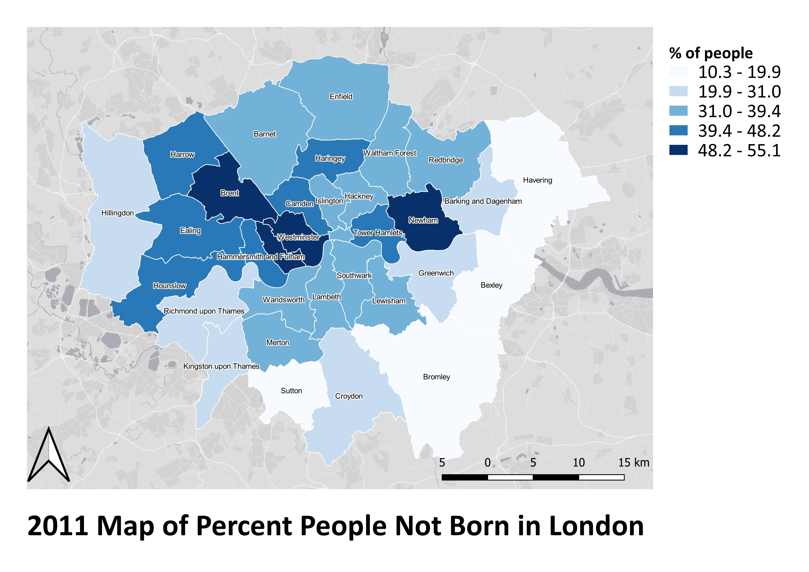
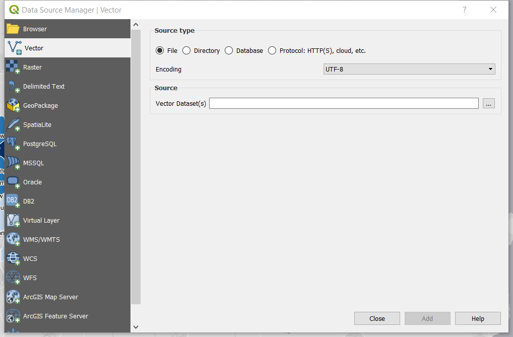
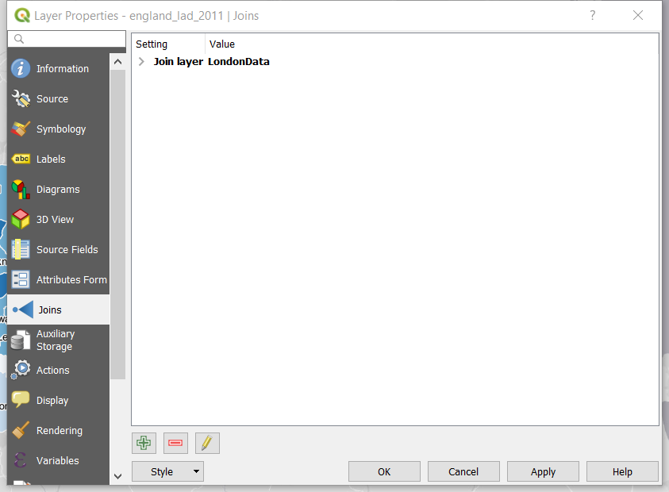
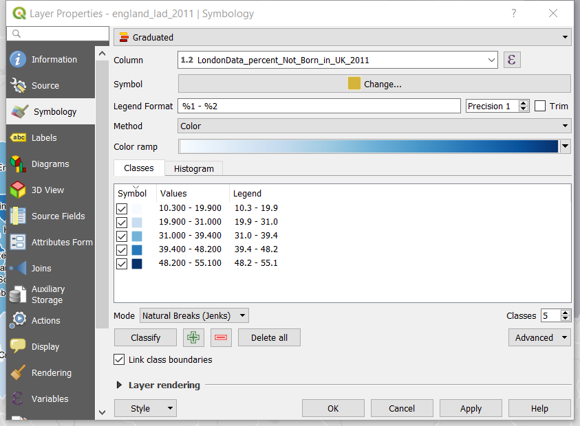
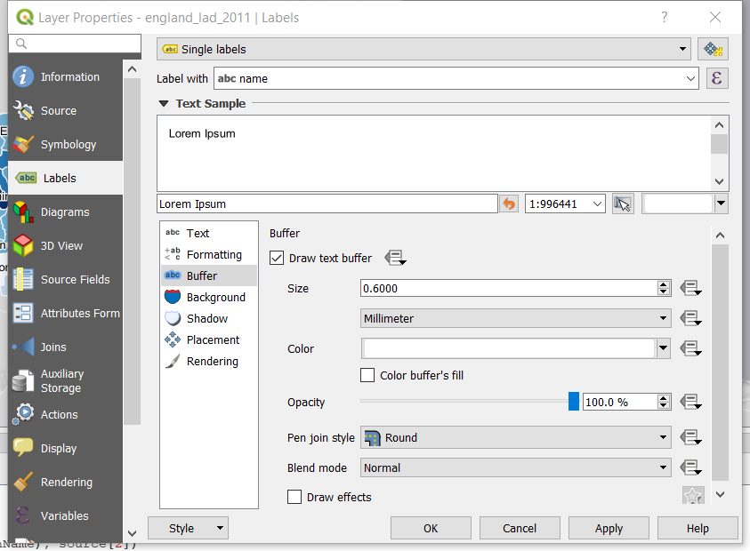
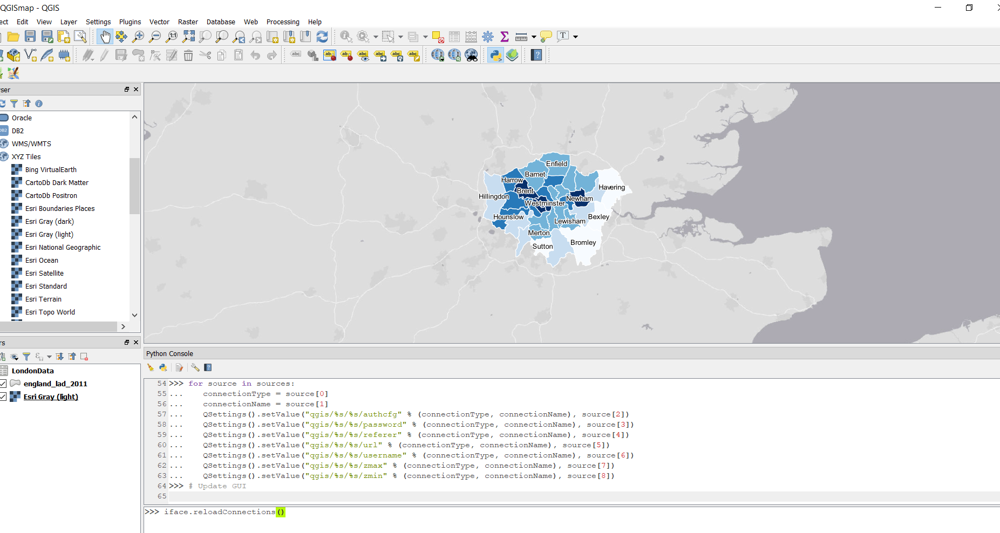
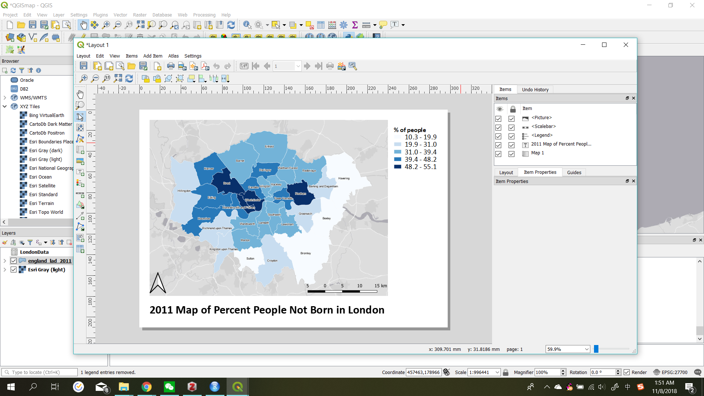

```{r setup, include=FALSE}
knitr::opts_chunk$set(echo = TRUE)
```

## CASA0013 GIS Assessment

### Part 1

In this part, two maps were produced with QGIS and RStudio seperately. They are displayed here with brief descriptions about the procedures of making the maps, as well as a critical comparison of the tools used to produce them. 

* Map created with QGIS

This a map showing the the percentage of people not born in London of each Borough with deeper blue indicating higher percentage. 



The data was fetched from UK Data Services, with seperate london boundary shapefile and csv file of census data on population structure. To start making the map, add these two layers to QGIS through "Vector" tab and "Delimited Text" tab seperately in "Data Source Manager" accessed from the "Layer" menu.


Before joining two layers, check the attribute table of shapefile and the csv file to make sure there is a common field that can be set as the "join field". Then the csv data was joined to the boundary shapefile by going to the "join" tab in the "properties" window of the boundary layer. 


Next, display the data as desired through adjusting features under "Symbology" and "Label" tabs in the "properties" window of the boundary layer.




Base map was added through "XYZ Tiles". To load the base map options, run the python script(https://raw.githubusercontent.com/klakar/QGIS_resources/master/collections/Geosupportsystem/python/qgis_basemaps.py) get from the tutorial online (https://opengislab.com/blog/2018/4/15/add-basemaps-in-qgis-30) in the "Python Console" accessed from "Plugins" menu.


Lastly, the layout was generated using "Layout Manager".


While using QGIS to display the data, the result of visualization can be reflected immediately and adjusted accordingly to best convey the information. The color, style of lines, and style of text are directly demonstrated before being chosen to be applied to the map. Besides, it is intuitive to generate layout in a GUI-based tool because there is nested functions of adding different cartographical elements and they can be easily adjusted and moved around for the desired consequence. 

* Map created with RStudio

This is a map showing the ...


First, (Code involved)

```{r cars}
summary(cars)
```

Then, (Other supporting descriptions and procedure illustrations)

```{r pressure, echo=FALSE}
plot(pressure)
```

While using RStudio, (advantages and drawbacks)

*Conclusion

As a brief conclusion, ...
