```{r setup, include=FALSE}
knitr::opts_chunk$set(echo = TRUE)
```

### 1. Part One

In this part, two maps were produced with QGIS and RStudio seperately. They are displayed here with brief descriptions about the procedures of making the maps, as well as a critical comparison of the tools used to produce them. 

#### 1.1 Map created with QGIS

This a map showing the the percentage of people not born in London of each Borough with deeper blue indicating higher percentage. 

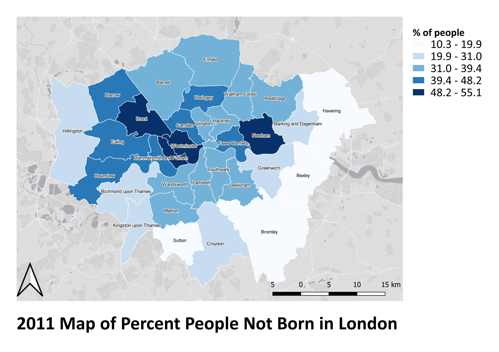


The data was fetched from UK Data Services, with seperate london boundary shapefile and csv file of census data on population structure. To start making the map, add these two layers to QGIS through "Vector" tab and "Delimited Text" tab seperately in "Data Source Manager" accessed from the "Layer" menu.

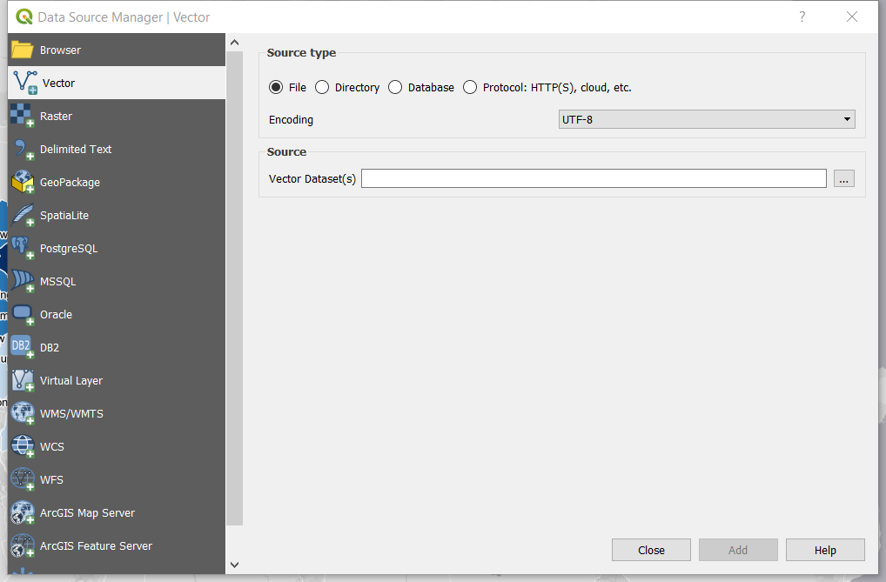


Before joining two layers, check the attribute table of shapefile and the csv file to make sure there is a common field that can be set as the "join field". Then the csv data was joined to the boundary shapefile by going to the "join" tab in the "properties" window of the boundary layer. 

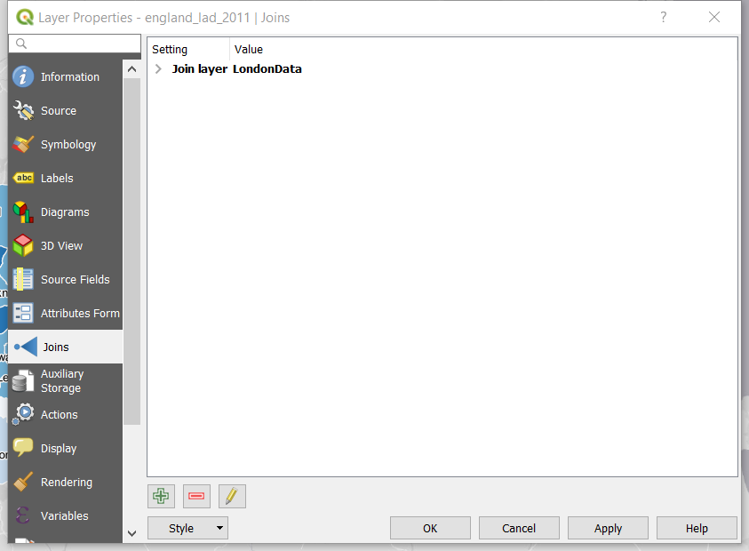


Next, display the data as desired through adjusting features under "Symbology" and "Label" tabs in the "properties" window of the boundary layer.

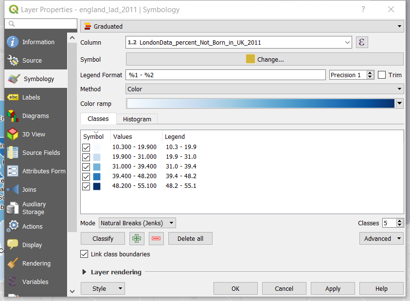


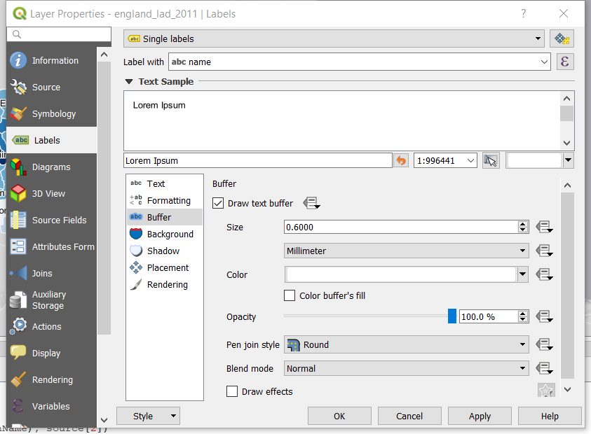


Base map was added through "XYZ Tiles". To load the base map options, run the [python script](https://raw.githubusercontent.com/klakar/QGIS_resources/master/collections/Geosupportsystem/python/qgis_basemaps.py) get from the tutorial [online](https://opengislab.com/blog/2018/4/15/add-basemaps-in-qgis-30) in the "Python Console" accessed from "Plugins" menu.

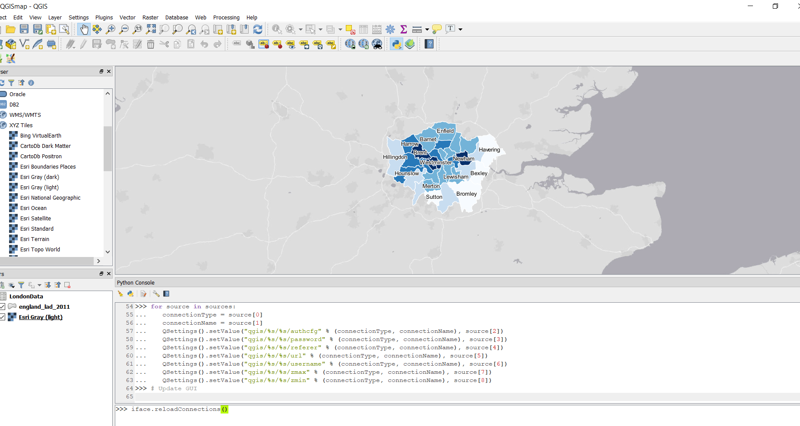


Lastly, the layout was generated using "Layout Manager".

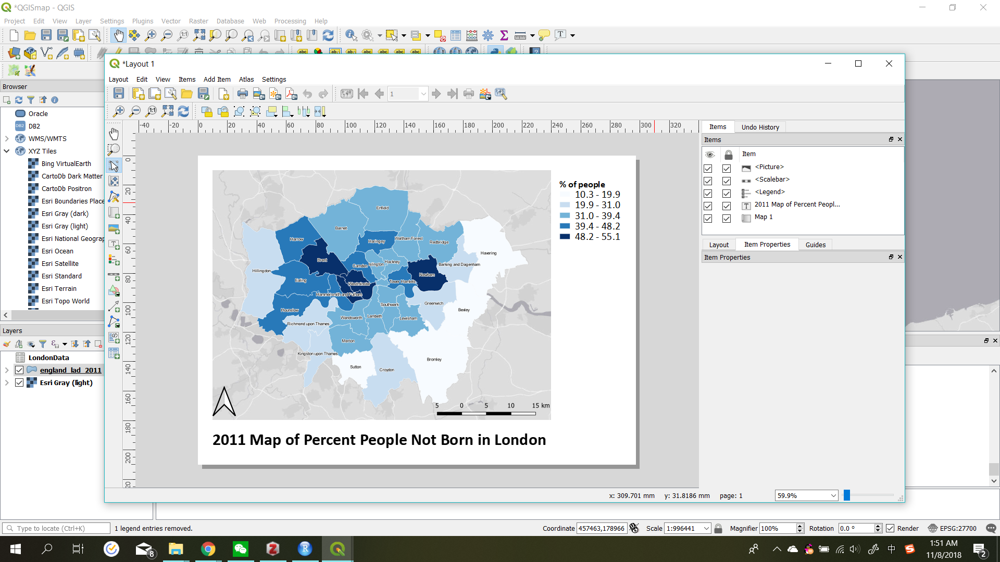


As shown in the "Data Source Manager", QGIS is capable of compiling various types of data and adding them via different pathes. This makes it convenient to work together with all kinds of open sourse databases. Besides, various plugins including python console are supported, which gives it possibility to be conneted with resources and functions of other platforms.

While using QGIS to display the data, the result of visualization can be reflected immediately and adjusted accordingly to best convey the information. The color, style of lines, and style of text are directly demonstrated before being chosen to be applied to the map. Besides, it is intuitive to generate layout in a GUI-based tool because there is nested functions of adding different cartographical elements and they can be easily adjusted and moved around for the desired consequence. 

#### 1.2 Map created with RStudio

Below are codes demonstrating the steps of building up an interactive map of the same theme and similar rendering style using the same data files and made with the tmap package in RStudio.

i) Load packages

```{r,echo=TRUE}
library(tidyverse)
library(sp)
library(rgdal)
library(shinyjs)
library(htmltools)
library(RColorBrewer)
library(tmaptools)
library(tmap)
```

ii) Read the London Borough boundary shapefile and census csv file from a local directory.

```{r, echo=TRUE}
BoroughBd <- readOGR("Part1/shapefiles/england_lad_2011.shp")
LondonData <- read.csv("Part1/LondonData.csv")
```

iii) Manipulate the data to get a sp feature neccessary for plotting.

```{r, echo=TRUE}
LondonData <- data.frame(LondonData)
LondonBoroughs <- LondonData[grep("^E09",LondonData[,3]),] # select rows of London Boroughs
LondonBoroughs <- LondonBoroughs[,c(3,16)] # select needed columns
LondonBoroughs <- LondonBoroughs[2:34,] # get rid of duplicated column
BoroughBd@data <- data.frame(BoroughBd@data,LondonBoroughs[match(BoroughBd@data[,"code"],LondonBoroughs[,"code"]),]) # join the attribute data to the SP data
names(BoroughBd)[3] <- c("Borough Name") # rename the column
names(BoroughBd)[6] <- c("Percentage")
BoroughBd <- BoroughBd[c(3,6)] # extract the two neccessary columns
Borough_repro <-spTransform(BoroughBd, CRS("+proj=longlat +datum=WGS84")) #reproject the data

```

iv) Plot the reprojected sp feature with tmap package and set to desired style.

```{r, echo=TRUE}
tmap_mode("view")
tm_shape(Borough_repro) +
  tm_polygons("Percentage",
              style="jenks",
              palette=get_brewer_pal("Blues", n = 5,contrast = c(0,1)),
              border.col = "white",
              midpoint=NA,
              popup.vars="Percentage",
              title="% of people not born in London")
```

Compared to QGIS, R is more handy for data maniputaling especially for attribute data. It is easy to clean and slice neccessary data with built-in functions in R. Besides, it is much easier to manage the project with R when it has to be revised frequently or involves group work becaused the connection with Git makes it possible to perform version control and process the work at multiple workspaces. 

As for visualization, in terms of making simple thematic map, although R is capable of making interactive maps with certain packages, it seems not to be inferior to a GUI-based tool since those rendering features are all subject to customization through coding. It takes much more efforts to get to know and become familier with the tools and functions available in R since they are not directly shown anywhere. Besides, to realized the desired visualization effect, which involves in lots of detail tweaking, cartographers will need to refer to the documentations and type the code all the time. It also takes extra time to debugging and figuring out results that each line of code will lead to. 

***

### 2. Part Two

This part aims to solve six given questions about certain spatial features and relationships by choosing suitable analytical tools and methods. The process of the solution design and analysis will also be discussed.

#### 2.1 Problem Overview and Solution Design

To answer the questions, approaches including geometry calculation, buffer generation, location query, attribute manipulation, statistic summarization, and spatial clustering will be needed. These approaches can all be conducted with built-in geo-processing tools in ArcGIS, which can be easily found throughout the interface of the software and are intuitive to use. Thus, ArcGIS will be the main tool utilized to solve the problems. To perform these analysis with tools in ArcGIS, the existing data and information in the form of KML and CSV will need to be converted to Feature Class and the attribute table joined to features, which can be also done by conversion tools in the software.

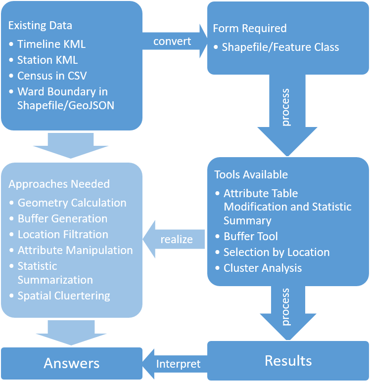


#### 2.2 Process and Methods

The detailed processes and tools used to solve each question is explained with the workflow diagram below.

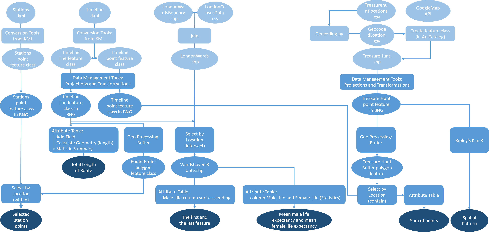


The first five questions essentially are all asking for a statistic summary of certain numerical attribute of a group of spatial features. Therefore, the answers were easily approached through the attribute tables of the feature class or shapefiles converted from the original data. However, when accomplishing this process in ArcGIS, some steps, such as conversion and reprojection, had to be repeated multiple times for different layers, which were kind of time-consuming and annoying. In this case, code-based environment might actually be more efficient to process the data. 
As for the last question, which is about analysis of point spatial pattern, pertinent analytical model is required to give an answer. Between the two available commonly used models for analyzing point spatial pattern, the Quadrat Analysis and Ripley's K test, Ripley's K is more reliable without the influence of scale and shape of observation window, so Ripley'K test was performed. While both ArcGIS and R has the tool or function to run the test, R was used in this case because certain error kept occurring with ArcGIS and failed to be solved.

#### 2.3 Results and Discussion

##### 2.3.1 Question 1: How far did you travel? 

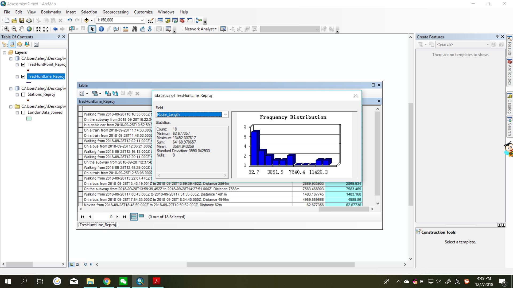


As shown above, the total length of lines is calculated to be 64148.978657 metres. That is to say, **the distance travelled is about 64 km.** However, the accuracy of this result is impacted by the accuracy of the raw timeline KML data from GoogleMap, because instead of recording the exact route of movement, the timeline function can only form a gerneral route by drawing straight lines between the spots that has been visited. Besides, the process of reprojecting the data to BNG could also have caused some error for calculating the length of lines.

##### 2.3.2 Question 2: How many TfL station did your route pass within 100 metres distance?

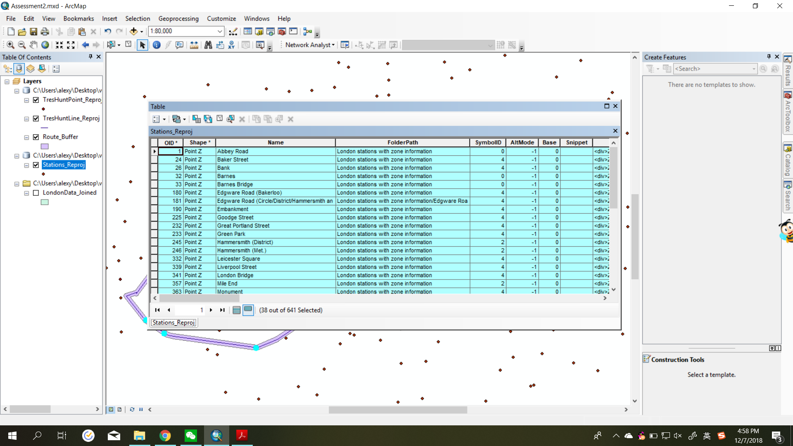


By selecting stations within the buffer layer, 38 stations are selected. Thus, **the route passes 38 stations within 100 metres.**

##### 2.3.3 Question 3: How many points did you score based on treasure hunt locations they managed to get within 300 metres of?

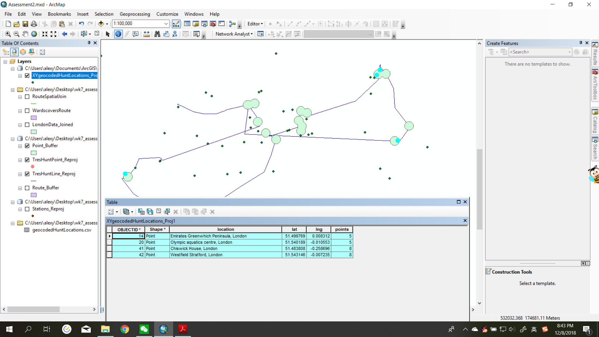

By summing up the numbers in the "points" field of selected entries, **the total points scored is 26.** When approaching this answer, the GoogleMap API and a chunk of python code (see appendix 1) is used to geocode the treasure hunt locations. This process of geocoding could have led to some error when mapping the locations.

##### 2.3.4 Question 4: Which Wards did you pass through that had the (a) lowest and (b) the highest rates of Male Life Expectancy?

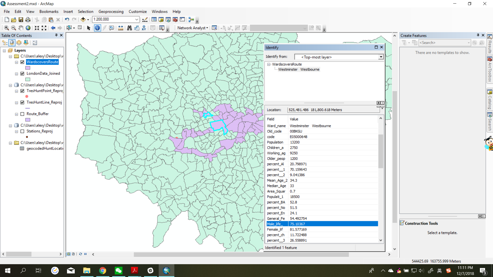


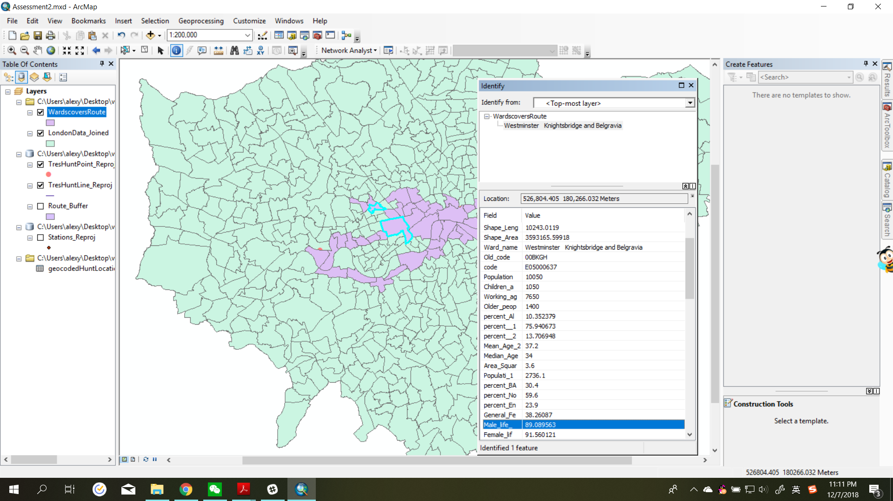


In the attribute table of the layer of wards passed through, by sorting the field of male life expectancy, it can be seen that the first entry is **Westbourne**, which has the lowest rate, and the last is **Knightsbridge and Belgravia**, which has the highest rate. 

##### 2.3.5 Question 5: What was the average life expectancy at birth for babies born in those wards along the whole route?

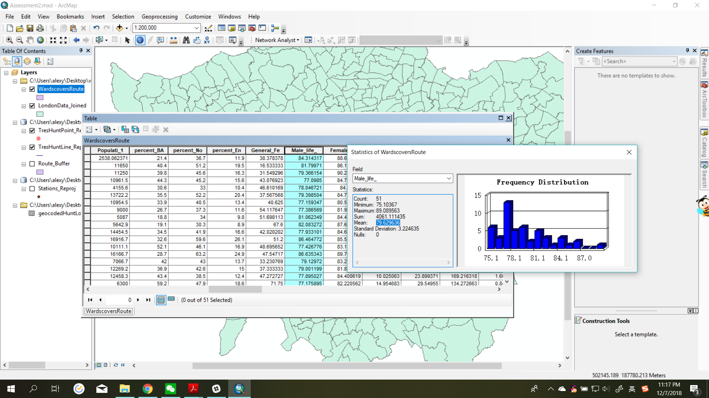

Again, by looking at the statistics of the attribute table of the related layer, **the average life expectancy for male is 79.63 and for female is 84.52.**

##### 2.3.6 Question 6: Is there any spatial patterns for CASA Treasure Hunt locations or are they randomly distributed?

The Ripley's K test was perfomed using the kest function in the spatstat package in R. The code used is shown as below.
```{r,echo=TRUE}
#load the necessary libraries
library(spatstat)
library(sp)
library(rgeos)
library(maptools)
library(GISTools)
library(tmap)
library(sf)
library(geojsonio)
library(tmaptools)
library(rgdal)

#read the data of London wards and treasure hunt locations
TreasHuntPoint <- readOGR("Part2/shapefiles/TreasHuntPoints.shp")
LondonWards <- readOGR("Part2/shapefiles/LondonData_Joined.shp")

#run a point pattern analysis with ripley's K
window <- as.owin(LondonWards)
TreasHunt.ppp <- ppp(x=TreasHuntPoint@coords[,1],y=TreasHuntPoint@coords[,2],window=window)
K <- Kest(TreasHunt.ppp, correction="border")
plot(K)
```

The plot shows that the calculated K value is above the expected value almost all the time, indicating that **the treasure hunt points are clustred in London**. 

***

### 3. Part Three

